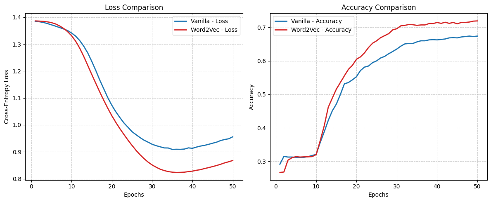
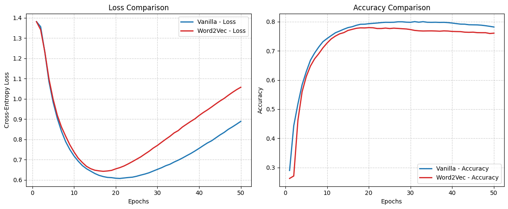
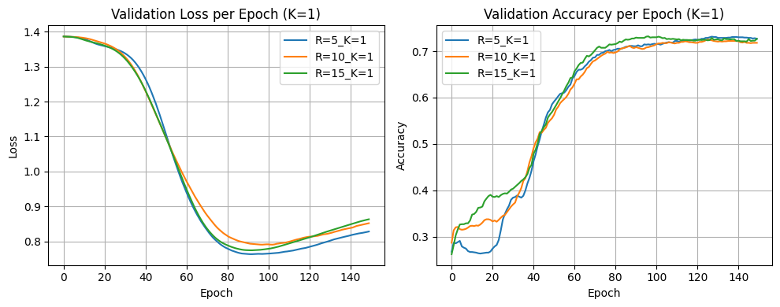
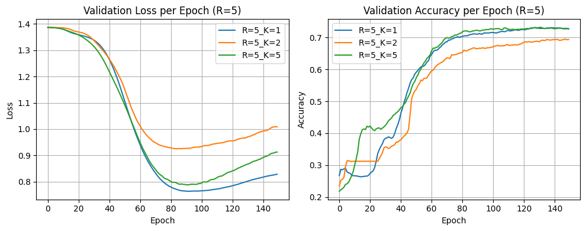

# Word2Vec Implementation for Text Classification

This project implements the Word2Vec (Skip-Gram with Negative Sampling) model from scratch using PyTorch. The primary goal is to learn high-quality word embeddings from a large text corpus (WikiText-2).

The quality of the learned embeddings is then evaluated on a downstream text classification task (AG News dataset). We compare the performance of a classification model initialized with our pre-trained Word2Vec embeddings against a model trained from scratch with a random initialization.

## Project Structure

  * [`word2vec.ipynb`](notebooks/word2vec.ipynb): Main script for training the Word2Vec model. It processes the WikiText-2 dataset, implements the Word2Vec model, and includes a `Trainer` class to handle training using a contrastive learning objective with negative sampling. The embedding weights are saved for the following task.
  * [`classification.ipynb`](notebooks/classification.ipynb): Script for the downstream classification task. It loads the pre-trained embeddings from `checkpoints/`, initializes a `ClassAttentionModel`, and trains it on the AG News dataset. It also runs the comparative experiments against a baseline trained from scratch. An ablation study showed the impact of two Word2Vec hyperparameters : `R` the positive context radius and `K` the number of negative samples per positive sample.

## Results Summary

The experiments confirm the effectiveness of pre-training:

1.  **Pre-training vs. Vanilla**: Initializing the classifier with pre-trained Word2Vec embeddings **outperforms** a randomly initialized model, leading to lower validation loss and higher accuracy.

  
*Validation accuracy and loss comparison between the classifier initialized with pre-trained Word2Vec embeddings and Vanilla baseline (5,000 labeled samples).*

2.  **Impact of Data Scarcity**: The benefit of pre-training is **most significant when labeled data is scarce**. As the amount of labeled data increases (e.g., 25,000 samples), the gap between the two models narrows, but the pre-trained model still converges faster and to a better result.

  
*Validation accuracy and loss comparison between the classifier initialized with pre-trained Word2Vec embeddings and Vanilla baseline (25,000 labeled samples).*

3.  **Ablation on `R` (Context Radius)**: For this specific classification task, smaller context windows (e.g., **`R=5`**) yielded the best performance. This suggests that local semantic information was more valuable than a wider, more general context.

  
*Impact of context radius R on validation accuracy and loss.*

4.  **Ablation on `K` (Negative Sample Ratio)**: A smaller ratio of negative samples (e.g., **`K=1`**) produced the best classification results. Larger values of `K` seemed to focus the optimization too much on distinguishing random pairs, resulting in less informative embeddings for this task.

  
*Impact of negative samples K on validation accuracy and loss.*

## How to Run

First, clone the repository and install the required dependencies with `pip install -r requirements.txt`.

### Step 1: Train Word2Vec Embeddings

Run the `word2vec.ipynb` notebook cells in order. It will :
- Train the Word2Vec model on the WikiText-2 dataset.
- Train all the model configurations required for the next step (e.g., varying `R` and `K`).
- Create a `checkpoints/` directory and populate it with the trained embedding weights (`.ckpt` files).

### Step 2: Run Classification Experiments

Run the `classification.ipynb` notebook cells in order. It will :
- Load the pre-trained embeddings from the `checkpoints/` folder.
- Train the `ClassAttentionModel` on the AG News dataset.
- Run the experiment comparing Word2Vec initialization vs. Vanilla (random) initialization.
- Run the ablation studies on the `R` and `K` hyperparameters.
- Display the final plots in the notebook itself.
